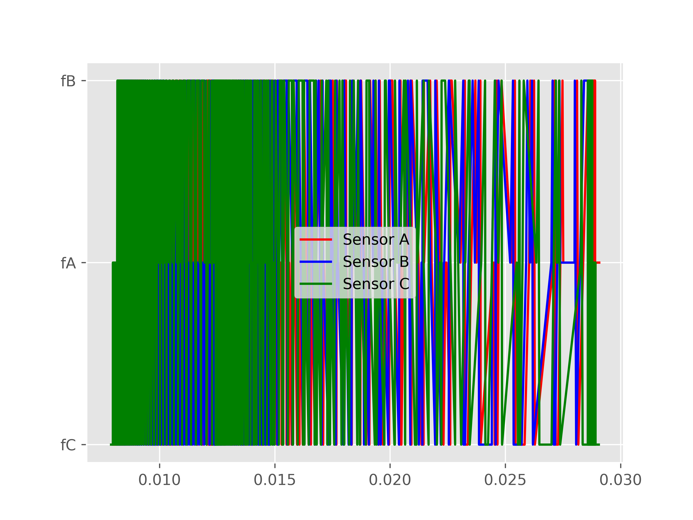
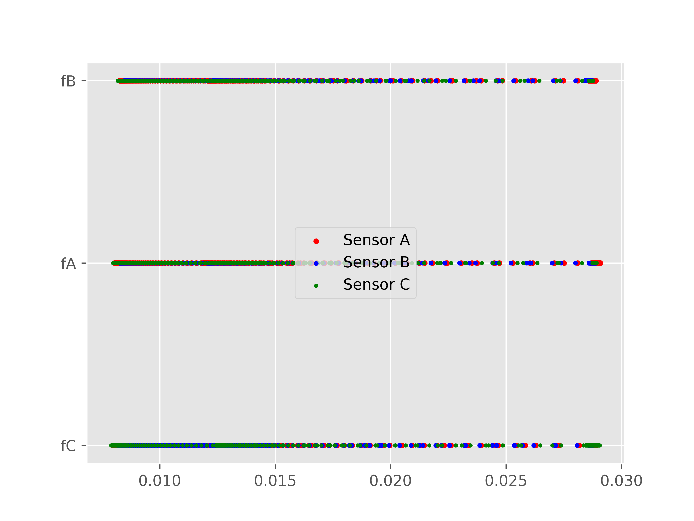

# TRIANGULATION BASED 2D MAPPING :

## **Motivation :**
The echo location method explored in the page [Echo Location Documentation](./../echoLocation/Readme.md) presents a way of locating the angle and distance between 2 types of RPAS using acoustic trianglulation. It is to be noted that, if the 3 microphones in the Master RPAS is replaced with buzzers that emit sound waves of frequency fA, fB and fC; and the one buzzer is replaced by frequency selective microphones, we obtain the same results but at a cheaper price since buzzers are comparatively cheaper than microphones.

On further exploring this idea, a combination of 3 microphones and 3 buzzers (emitting frequency fA, fB, fC respectively) would enable us to get a 2 dimensional map of an room using the reflected sound off the walls. In other words a 360 degree RADAR with zero moving parts.

## **Result :**

