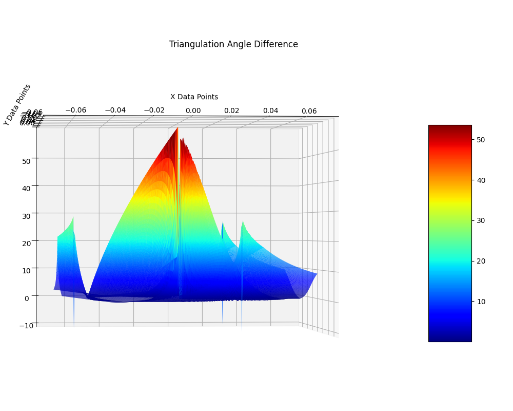
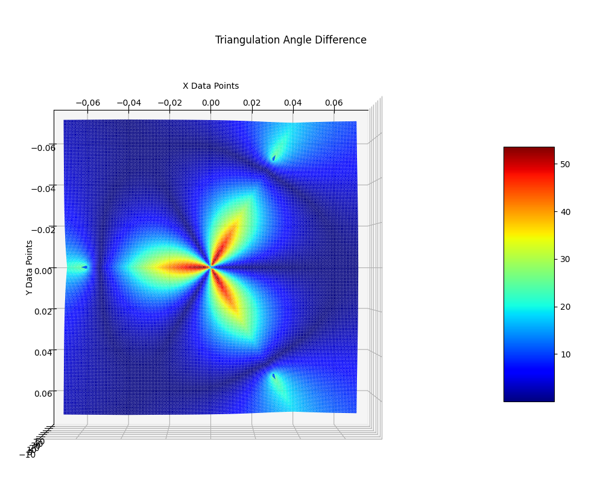
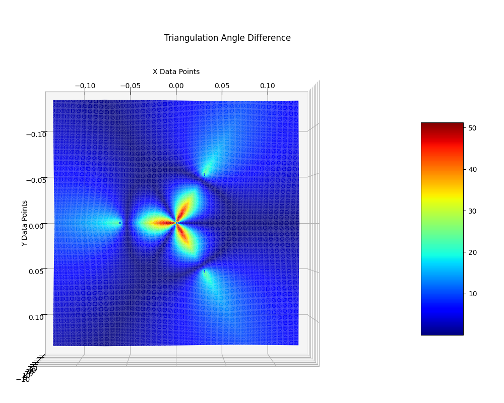
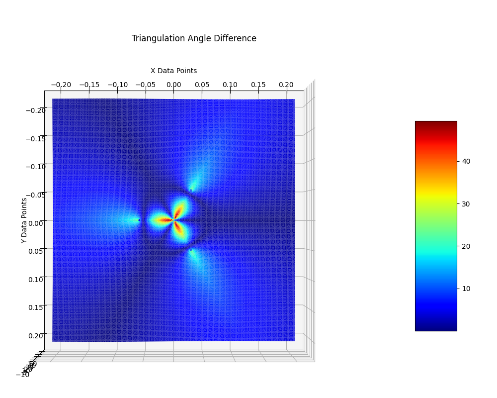
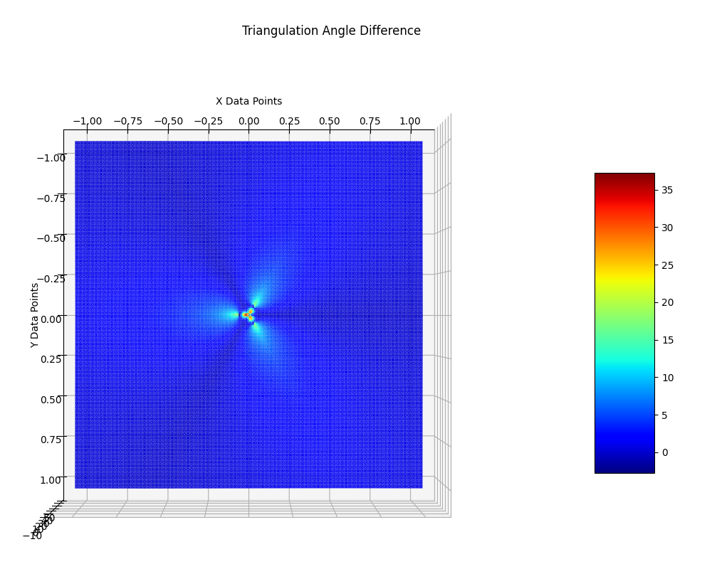
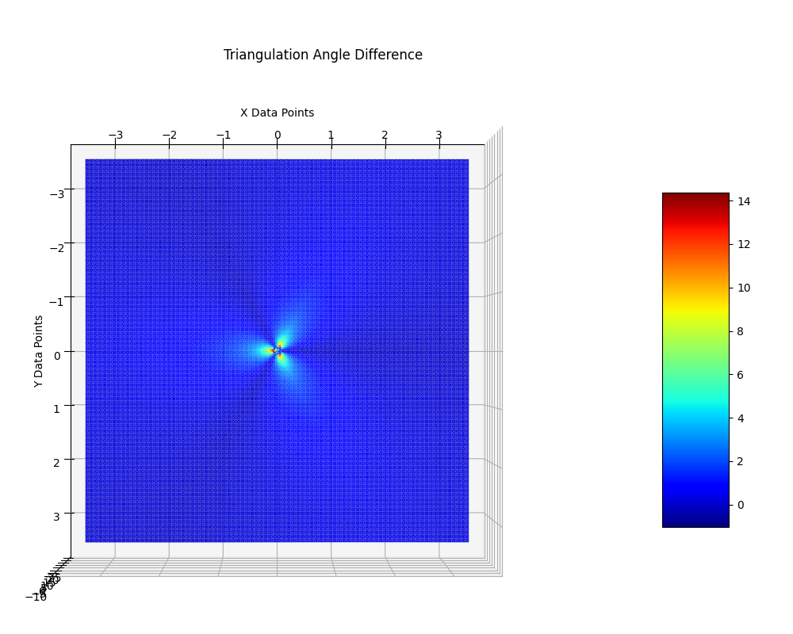
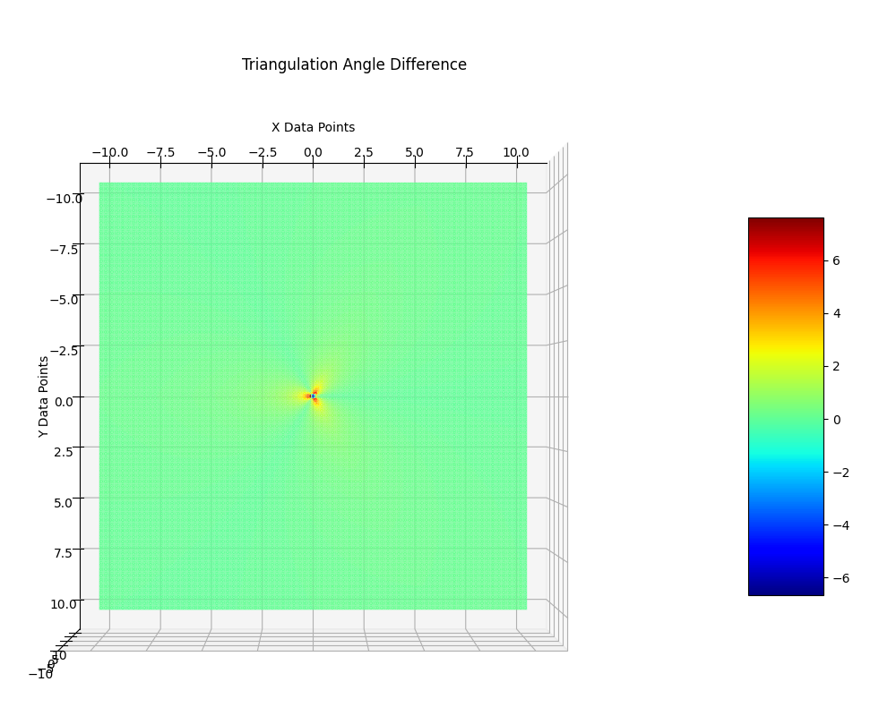

# TRIANGULATION BASED ECHO LOCATION :

## **Motivation :**
The primary method of locating the position of objects in a nearby vicinity is either by the use of GPS, RADAR and camera. The distances involved in our project are small enough that GPS won't be able to output accurately. The RADAR mechanism though feasible has a few rotary joints which we plan on avoiding. Camera on the other hand are expensive and the image processing over head required tends to need a dedicated server or a more powerful hardware. It also provides only a small field of view.

## **Devised Solution :**
We thus plan to use a triangulation based echo location methodology to detect the relative position of similar sensors. We intend to use ultrasound waves ( freq > 20kHz ) to be able to measure distance with comparatively cheaper hardware since sound waves travel very much slover compared to radio waves or visible light. We plan to call each unit of this sensor **"Relative Position & Angle Sensor"** or **"RPAS"**.

## **Proposed Method :**
There will primarily be two types of RPAS.
1. Master RPAS
1. Slave RPAS

#### **1. Master RPAS**
This type of RPAS will have 1 frequency selective buzzer and 3 high sensitivity microphones capable of detecting ultrasound waves. These microphones will be placed along the vertices of an equilateral triangle and the frequency selective buzzer will be tuned to emit sound waves of a given frequency ( say **X** kHz). The microphones will be tuned to respond to a certain set of frequency ranges ( say **Y** & **Z** kHz ) emitted by the Slave RPAS. A microcontroller ( **attiny85** ) will be converting these signals from the microphone to binary signal pulses for the main microcontroller to process.

#### **2. Slave RPAS**
This type of RPAS will have only one high sensitivity microphone and one frequency selective buzzer. The microphone will respond only to the master frequency ( **X** kHz ) and will trigger the certain slave frequency from the buzzer ( **Y** or **Z** kHz ). This module will be controlled independently by a microcontroller ( attiny85 ) and won't be needed to be interfaced with the main microcontroller of the slave bot.

### **Angle Measurement Mechanism**
Whenever the slave RPAS emit a sound of a certain bandwidth, each of the master RPAS's three high sensitivity microphones will detect the sound wave at different time instances and this interval will be stored. The temperature will be measured by an on-board sensor in the master bot and this will be used to calculate the speed of sound at that instant. Based on the intervals between the sound waves getting detected by each microphone and the order in which this detection took place would output the angle of the source of sound ( Slave RPAS ) with respect to the Master RPAS.

### **Relative Distance Measurement Mechanism**
Periodically the Master RPAS will emit ultrasound waves of the master frequency ( **X** kHz ). All the slaves will be tuned to respond with their slave frequency upon hearing this master frequency. The ultrasound waves emitted by the Slave RPAS will reach the Master RPAS and this will imitate the characteristic of a RADAR echo. The intervals measured during the angle measurement process will be interpolated to calculate the time it would have taken the sound wave to reach the center of the Master RPAS. The time between the emission of master frequency and the time taken for the slave ultrasound wave to reach the center of the Master RPAS minus the average processing time of the microcontroller( attiny85 ) ( to be calibrated ) will be considered as the round trip time and will be used to measure the distance between Master RPAS and various Slave RPAS.

## **Result :**
To measure the accuracy, a sound source was simulated at various points on the plane with the circumcenter of the Master RPA at the origin. The difference between the actual and observed angles were plotted as a colored trianglated 3D plot and the bottom view representing the accuracy of various regions based on color is shown below for various zoom levels.

